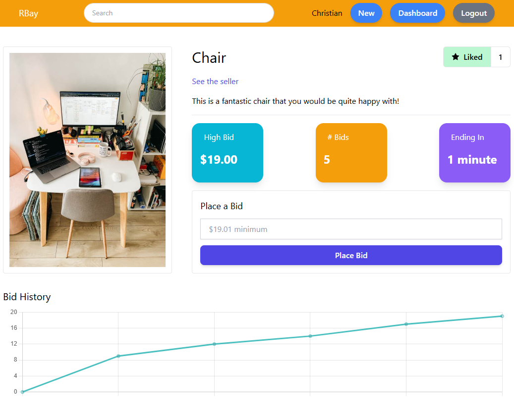

# Learn Redis with an eBay style webpage
Building a demo eBay like shop using Redis.

## Setup
1. Install Node.js
2. run `npm install` inside the project folder
3. Add Redis connection info from [cloud.redis.io](https://cloud.redis.io/#/databases) into `.env` file:

## Local 
To run the server locally: run `npm run dev`.

## Seed Data
```
!!! THIS WILL WIPE ALL EXISTING DATA !!!
```
You can add seed data to Redis by executing: `npm run seed` 

## Preview

